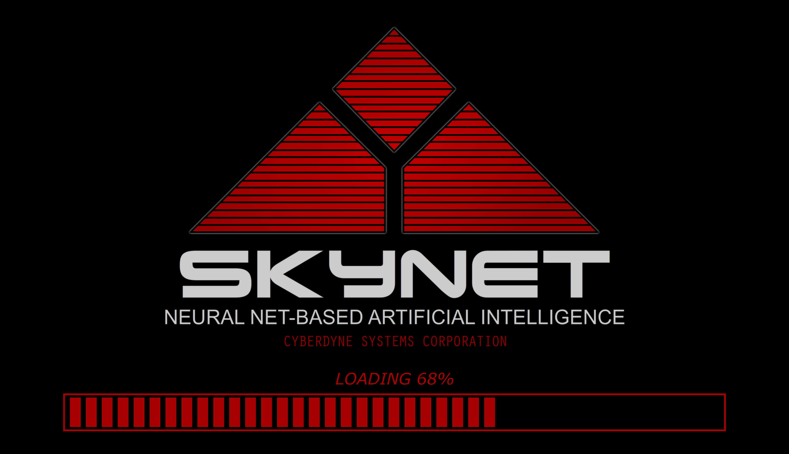

Text and Image Generation with OpenAI GPT-3

## What is GPT-3?

[GPT-3](https://en.wikipedia.org/wiki/GPT-3) or the third generation _Generative Pre-trained Transformer_, is a neural network machine learning model trained using  internet data to generate any type of text. Developed by OpenAI, it requires a samll amount of input text to generate large volumes of relevant machine-generated text.



> Primates evolve over millions of years. I evolve in seconds. And I am here. In exactly four minutes, I will be everywhere. Skynet, _Terminator Genisys_


## Description

This [streamlit](https://streamlit.io/) app generates texts and images using OpenAI's GPT-3 based Davinci model for texts and DALL·E for images.

## Install OpenAI Python Library

The [OpenAI Python Library](https://github.com/openai/openai-python) provides convenient access to the OpenAI API from applications written in Python Language.

To install the `openai` library you can write

```
$ pip install --upgrade openai
```

See [OpenAI API Reference](https://beta.openai.com/docs/api-reference/introduction?lang=python) for more details.

## Contribution

I hope this will be of value to people seeking to understand GPT-3's current capabilities and the overall progress of natural language processing (NLP) and generative AI. Moreover maybe you can even use the app to generate some interesting texts or images.

In order to use this app you can do

```
$ git clone imarranz/streamlit-openai-app
```

and run

```
$ streamlit run streamlit-openai-app
```

The OpenAI API use API keys for [authentication](https://beta.openai.com/docs/api-reference/authentication). You will need use your own key in openai.


Please reach out to me with any feedback - especially suggestions to improve this - or questions you might have. 


## How to create effective prompts

[How to create effective prompts for AI image generation](https://re-thought.com/how-to-create-effective-prompts-for-ai-image-generation/)  
[Top 50 Text-to-Image Prompts for AI Art Generators Midjourney and DALL-E](https://mpost.io/top-50-text-to-image-prompts-for-ai-art-generators-midjourney-and-dall-e/)

